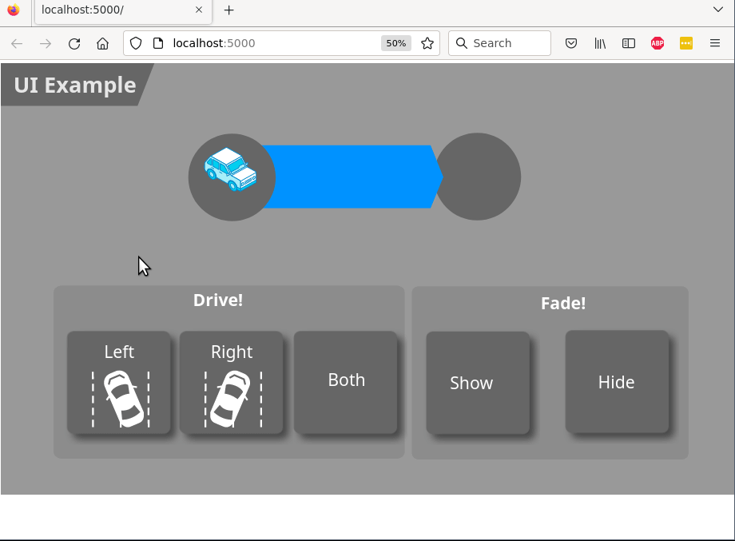

# UI Prototyping Library and Example
Example how Corola creates user interfaces for demonstrators.

This repository contains the library and a minimum working example of how we implement web-based UIs for our demonstrators (see [Link to Blog](#) for more details).

**Disclaimer: We are aware, that this repository does not follow common JavaScript conventions, like using a build system or `npm` integration.**

## How to run
- Create a python virtual environment. The code was tested with Python 3.9, but should run with most versions that support Flask. Install the requirements by `pip install -r requirements.txt`.
- Strip the example SVG file with `make svg`
- Run the server with `make serve`
- Access the website with at http://localhost:5000
